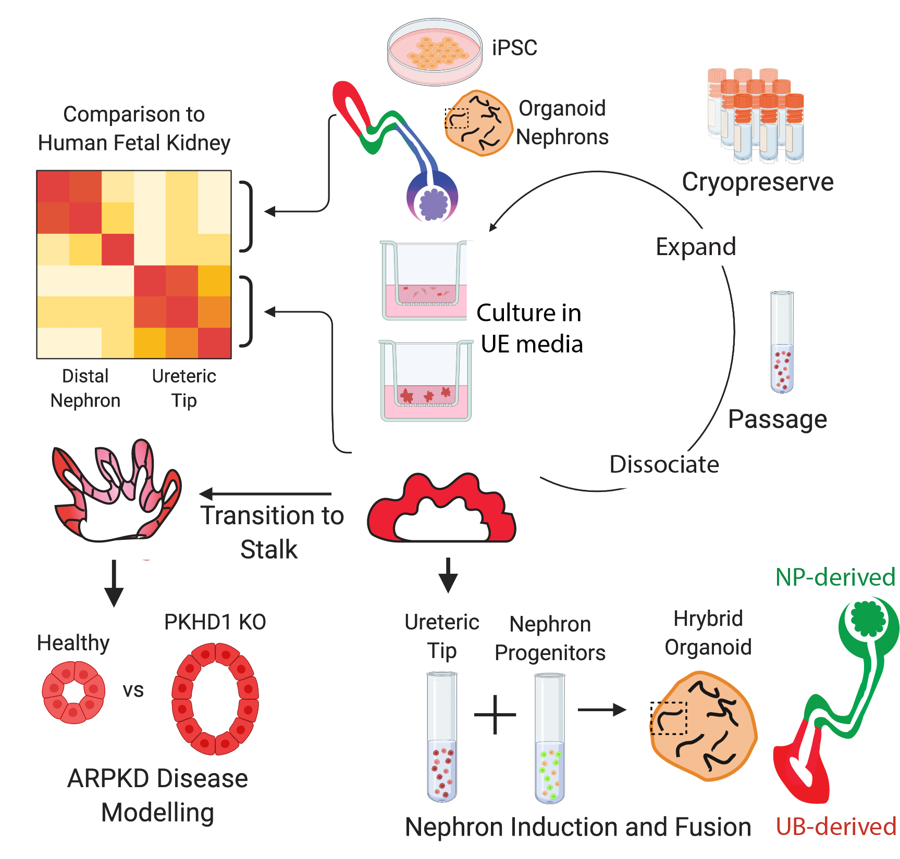

# Howden, Wilson et al. 2020

This repository is a [workflowr project][] showing the analysis and output relating to **[Howden, Wilson et al. 2020][]: Plasticity of distal nephron epithelia from human kidney
organoids enables the induction of ureteric tip and stalk;** *Cell Stem Cell*  
 

## Graphical Abstract

## Summary
During development, distinct progenitors contribute to the nephrons versus the ureteric epithelium of the
kidney. Indeed, previous human pluripotent stem-cell-derived models of kidney tissue either contain
nephrons or pattern specifically to the ureteric epithelium. By re-analyzing the transcriptional distinction
between distal nephron and ureteric epithelium in human fetal kidney, we show here that, while existing
nephron-containing kidney organoids contain distal nephron epithelium and no ureteric epithelium, this
distal nephron segment alone displays significant in vitro plasticity and can adopt a ureteric epithelial tip
identity when isolated and cultured in defined conditions. “Induced”
ureteric epithelium cultures can be
cryopreserved, serially passaged without loss of identity, and transitioned toward a collecting duct fate.
Cultures harboring loss-of-function mutations in PKHD1 also recapitulate the cystic phenotype associated
with autosomal recessive polycystic kidney disease.

## Authors
[Sara E. Howden][] (lead author, contact) 
[Sean B. Wilson][] (lead author, repository owner) 
[Melissa H. Little][] (senior author, contact)   
Ella Groenewegen 
Lakshi Starks 
Thomas A. Forbes 
Ker Sin Tan 
Jessica M. Vanslambrouck 
Emily M. Holloway 
Yi-Hsien Chen 
Sanjay Jain 
Jason R. Spence 
 

## Data availability
The data used in this work is available at the following locations: 
[GSE161255][]: hPSC-derived sequencing data including bulk and single cell RNA-seq 
[E-MTAB-9083][]: Human Fetal Kidney single cell RNA-seq, first published in [Holloway et al. 2020][] 
 
This website was built using the amazing [workflowr][] package.
 

[workflowr project]: https://kidneyregeneration.github.io/HowdenWilson2020/
[workflowr]: https://github.com/jdblischak/workflowr
[Howden, Wilson et al. 2020]: https://github.com/KidneyRegeneration/HowdenWilson2020
[Sara E. Howden]: sara.howden@mcri.edu.au
[Sean B. Wilson]: https://github.com/sbwilson91
[Melissa H. Little]: melissa.little@mcri.edu.au
[GSE161255]: https://www.ncbi.nlm.nih.gov/geo/query/acc.cgi?acc=GSE161255
[E-MTAB-9083]: https://www.ebi.ac.uk/arrayexpress/experiments/E-MTAB-9083/
[Holloway et al. 2020]: https://pubmed.ncbi.nlm.nih.gov/32841595/
